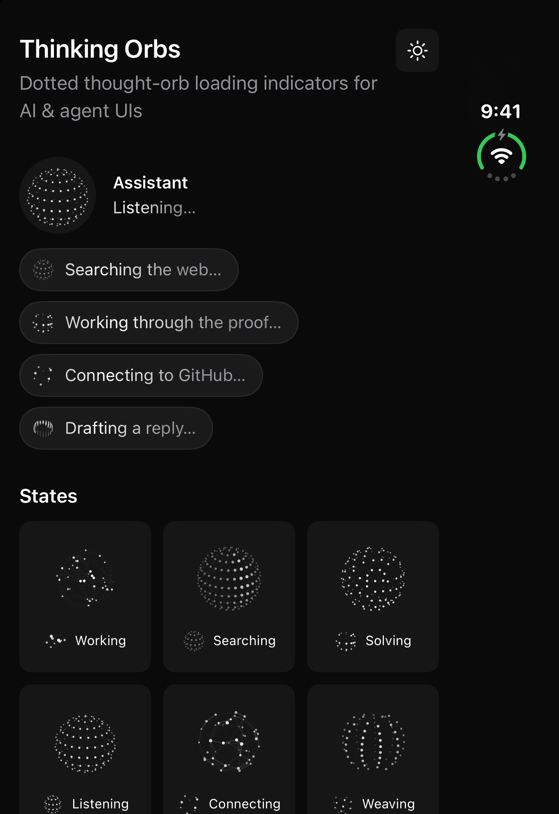
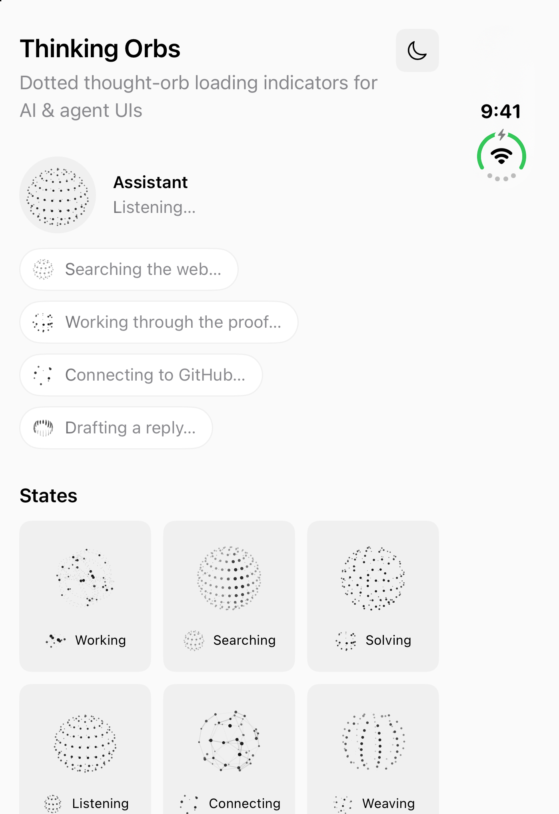

# Thinking Orbs for SwiftUI

Native SwiftUI port of [thinking-orbs](https://github.com/Jakubantalik/thinking-orbs) by Jakub Antalik: dotted thought-orb loading indicators for AI and agent UIs. It has nine hand-tuned animated states, each at two purpose-tuned sizes, drawn with `Canvas` and `TimelineView`. There's no Metal, no filters and no dependencies.

The geometry engine is a line-for-line transcription of the web engine. `swift test` checks every dot and line against golden vectors exported from the npm package (`thinking-orbs@0.3.2`): 72 cases, about 70,000 numbers, with a tolerance of 1e-4.

| Dark | Light |
|---|---|
|  |  |

## Install

Swift Package Manager: `https://github.com/hemal08ce094/ThinkingOrbsSwiftUI` on branch `main`, or from tag `0.1.0`.

```swift
.package(url: "https://github.com/hemal08ce094/ThinkingOrbsSwiftUI", from: "0.1.0")
```

Requires iOS 15, macOS 12, tvOS 15, watchOS 8 or visionOS 1.

## Usage

```swift
import ThinkingOrbs

ThinkingOrb(.searching)                       // 64pt, follows colorScheme
ThinkingOrb(.solving, size: .small)           // 20pt inline design
ThinkingOrb(.working, size: 20)               // integer literals work too
ThinkingOrb(.connecting, theme: .dark)        // pin light dots for a dark surface
ThinkingOrb(.composing, speed: 1.5)           // multiplier on the preset's baked speed
ThinkingOrb(.shaping, paused: isIdle)         // freeze on the current frame
ThinkingOrb(.listening, label: "Transcribing…") // VoiceOver label override
```

### States

| State | Animation |
|---|---|
| `.working` | particles on tilted orbits |
| `.searching` | a scan meridian sweeps a dotted globe |
| `.solving` | bands scramble, then click back solved |
| `.listening` | a waveform rolls through the rings |
| `.connecting` | a constellation wires itself |
| `.weaving` | three strands plait around the sphere |
| `.composing` | an undulating multi-band sash |
| `.breathing` | a ring slowly morphing |
| `.shaping` | dotted outline: circle → triangle → square |

### Sizes

`.large` (64pt) is for chat-avatar scale and `.small` (20pt) is for inline text. They are separate designs, each with its own dot count, dot size and speed, not one design scaled. To get another size, scale the nearest preset with `.scaleEffect`.

### Theme

The orbs are strictly monochrome. `.auto` (the default) reads `\.colorScheme` and updates live. `.dark` gives light ink for dark backgrounds, and `.light` gives dark ink for light backgrounds. The view background is transparent.

## Behaviour

- **One shared clock:** every orb reads the same epoch, so identical states stay in lockstep, the same as the web's `performance.now()`.
- **Reduce Motion:** draws one static frame (t = 0.6) that still follows the live colour scheme.
- **Offscreen:** `TimelineView` stops ticking by itself when the view isn't visible.
- **Accessibility:** the orb is an image element with a per-state label ("Searching…", and "Thinking…" for breathing).

## Lower-level API

```swift
// One frozen frame, for snapshots, widgets or ImageRenderer.
// t is preset-clock seconds (wall seconds × the preset's speed).
OrbCanvas(state: .searching, size: .large, dark: true, t: 1.7)

// Raw geometry: a z-sorted list of circles (and lines for .connecting).
let frame = OrbEngine.frame(.searching, size: .large, t: 1.7)
let resolved = resolvePreset(.searching, .large)  // mode, speed, scaled opts
```

## Demo

Open `Demo/ThinkingOrbsDemo.xcodeproj` (iOS 17, macOS 14, visionOS). It has hero chat pills, a gallery of all states at both sizes, and a playground with state, size, speed and play/pause controls. Pass `-scheme dark` or `-scheme light` as a launch argument to force the appearance.

## Keeping parity with upstream

```sh
npm install thinking-orbs            # anywhere; the script defaults to ~/node_modules
node scripts/extract-golden.mjs      # rewrites Tests/ThinkingOrbsTests/golden.json
swift test
```

When upstream retunes a preset, update `Sources/ThinkingOrbs/Engine/Presets.swift` until `testPresetsResolveLikeTheWeb` passes.

## Agent skill

`skill/thinking-orbs-swiftui/` is a Claude Code skill that adds the package to an app and swaps `ProgressView` spinners and "thinking" indicators for orbs. Copy it into `~/.claude/skills/`.

## License

MIT. Original design, engine and tunings © Jakub Antalik; SwiftUI port © hemal08ce094.
