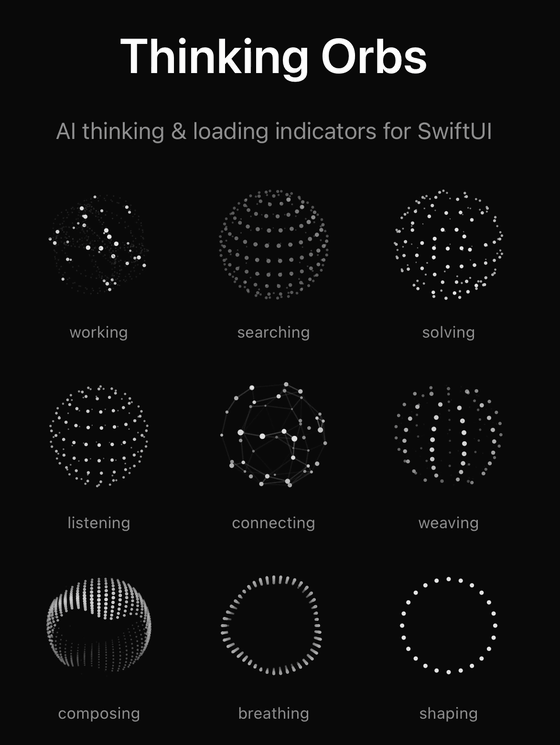
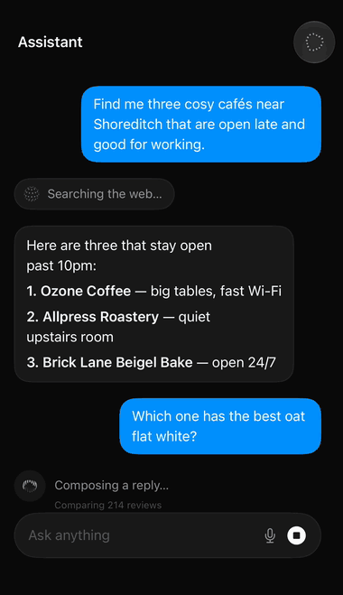
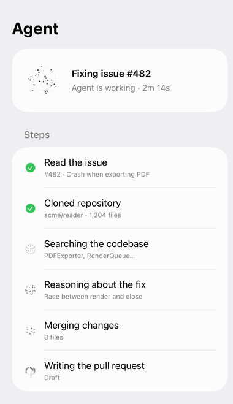
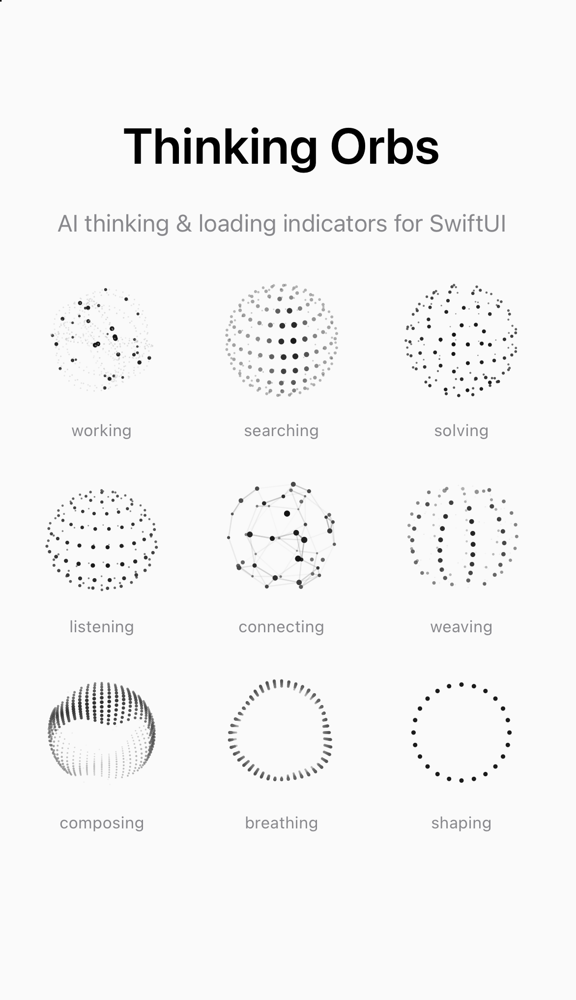

<p align="center">
  
</p>

<h1 align="center">Thinking Orbs for SwiftUI</h1>

<p align="center">
  <b>Animated AI thinking &amp; loading indicators for iOS, macOS and visionOS.</b><br>
  A drop-in SwiftUI replacement for <code>ProgressView</code> spinners and typing dots in AI chat, LLM, agent and voice-assistant apps.
</p>

<p align="center">
  
  
  
  
  
</p>

Thinking Orbs are dotted 3D animations that tell users *what* your AI is doing, not just that something is loading. There are nine states: working, searching, solving, listening, connecting, weaving, composing, breathing and shaping. Each one comes in two hand-tuned sizes, a 64pt avatar and a 20pt inline version. They're pure SwiftUI (`Canvas` and `TimelineView`), with no Metal, no Lottie files and no dependencies.

This is a native port of [thinking-orbs](https://github.com/Jakubantalik/thinking-orbs) by Jakub Antalik. It's geometry-exact: `swift test` checks all ~70,000 dot coordinates against the original web engine.

## Screenshots

<p align="center">
  
</p>

| AI chat (typing / thinking indicator) | AI agent progress | All nine states |
|---|---|---|
|  |  |  |

## Features

- **9 animated states** that map to real AI activity: web search, reasoning, voice input, tool calls, streaming a reply and more
- **2 tuned sizes**: 64pt for an assistant avatar, 20pt for inline status text, plus crisp custom sizes via `renderSize`
- **Dark and light mode**, following `colorScheme` automatically or pinned per view
- **Accessible**: VoiceOver labels ("Searching…"), and a static frame when Reduce Motion is on
- **Lightweight**: plain `Canvas` circle fills, pauses offscreen, every orb in sync on one shared clock
- **Every Apple platform**: iOS 15+, macOS 12+, visionOS 1+, tvOS 15+, watchOS 8+
- **Zero dependencies**, installed with Swift Package Manager
- **Agent skill included**, so Claude Code can add the orbs to your app for you

## Install

Swift Package Manager: `https://github.com/hemal08ce094/ThinkingOrbsSwiftUI` on branch `main`, or from tag `0.2.0`.

```swift
.package(url: "https://github.com/hemal08ce094/ThinkingOrbsSwiftUI", from: "0.2.0")
```

Requires iOS 15, macOS 12, tvOS 15, watchOS 8 or visionOS 1.

## Usage

```swift
import ThinkingOrbs

ThinkingOrb(.searching)                       // 64pt, follows colorScheme
ThinkingOrb(.solving, size: .small)           // 20pt inline design
ThinkingOrb(.working, size: 20)               // integer literals work too
ThinkingOrb(.connecting, theme: .dark)        // pin light dots for a dark surface
ThinkingOrb(.composing, speed: 1.5)           // multiplier on the preset's baked speed
ThinkingOrb(.shaping, paused: isIdle)         // freeze on the current frame
ThinkingOrb(.listening, label: "Transcribing…") // VoiceOver label override
ThinkingOrb(.listening, renderSize: 200)      // crisp hero size for a voice-mode screen
```

### Recipes

```swift
// "Thinking…" status pill in a chat
HStack(spacing: 8) {
    ThinkingOrb(.solving, size: .small)
    Text("Thinking…").foregroundStyle(.secondary)
}

// Replace a typing-dots bubble while the LLM streams
if isStreaming { ThinkingOrb(.composing, size: .small) }

// Assistant avatar that reflects the current phase
ThinkingOrb(phase == .search ? .searching : .solving)
    .background(.quaternary, in: Circle())
```

### States

| State | Animation | Use it for |
|---|---|---|
| `.working` | particles on tilted orbits | general agent work, tool calls, background tasks |
| `.searching` | a scan meridian sweeps a dotted globe | web search, RAG retrieval, document lookup |
| `.solving` | bands scramble, then click back solved | reasoning, "thinking…", planning, code analysis |
| `.listening` | a waveform rolls through the rings | voice input, dictation, speech-to-text |
| `.connecting` | a constellation wires itself | connecting to APIs, syncing, integrations |
| `.weaving` | three strands plait around the sphere | merging sources, multi-step pipelines |
| `.composing` | an undulating multi-band sash | streaming an LLM reply, writing, typing indicator |
| `.breathing` | a ring slowly morphing | idle "thinking" presence, waiting |
| `.shaping` | dotted outline: circle → triangle → square | image or layout generation |

### Sizes

`.large` (64pt) is for chat-avatar scale and `.small` (20pt) is for inline text. They are separate designs, each with its own dot count, dot size and speed, not one design scaled. For any other size, pass `renderSize:`. It redraws the nearest design sharply, where `scaleEffect` would blur it.

### Theme

The orbs are strictly monochrome. `.auto` (the default) reads `\.colorScheme` and updates live. `.dark` gives light ink for dark backgrounds, and `.light` gives dark ink for light backgrounds. The view background is transparent.

## Behaviour

- **One shared clock:** every orb reads the same epoch, so identical states stay in lockstep, the same as the web's `performance.now()`.
- **Reduce Motion:** draws one static frame (t = 0.6) that still follows the live colour scheme.
- **Offscreen:** `TimelineView` stops ticking by itself when the view isn't visible.
- **Accessibility:** the orb is an image element with a per-state label ("Searching…", and "Thinking…" for breathing).

## Lower-level API

```swift
// One frozen frame, for snapshots, widgets or ImageRenderer.
// t is preset-clock seconds (wall seconds × the preset's speed).
OrbCanvas(state: .searching, size: .large, dark: true, t: 1.7)

// Raw geometry: a z-sorted list of circles (and lines for .connecting).
let frame = OrbEngine.frame(.searching, size: .large, t: 1.7)
let resolved = resolvePreset(.searching, .large)  // mode, speed, scaled opts
```

## Demo

Open `Demo/ThinkingOrbsDemo.xcodeproj` (iOS 17, macOS 14, visionOS). It has hero chat pills, a gallery of all states at both sizes, and a playground with state, size, speed and play/pause controls. Launch arguments: `-scheme dark|light` forces the appearance, and `-screen chat|voice|agent|hero` opens the sample screens shown above.

## FAQ

**How do I make an AI "thinking" animation in SwiftUI?** Add the package, then use `ThinkingOrb(.solving)`. Pick the state that matches what your model is doing. See the States table.

**Can it replace a typing indicator in a chat app?** Yes. `ThinkingOrb(.composing, size: .small)` fits inside a message bubble.

**Does it work with UIKit?** Yes. Wrap it in a `UIHostingController`.

**Can I tint it?** The design is monochrome. For a tint, apply `.colorMultiply(.accentColor)` to a `theme: .dark` orb.

**Is it heavy?** No. Even the densest state draws under 600 circles per frame, and orbs stop animating when offscreen.

## Keeping parity with upstream

```sh
npm install thinking-orbs            # anywhere; the script defaults to ~/node_modules
node scripts/extract-golden.mjs      # rewrites Tests/ThinkingOrbsTests/golden.json
swift test
```

When upstream retunes a preset, update `Sources/ThinkingOrbs/Engine/Presets.swift` until `testPresetsResolveLikeTheWeb` passes.

## Agent skill

`skill/thinking-orbs-swiftui/` is a Claude Code skill that adds the package to an app and swaps `ProgressView` spinners and "thinking" indicators for orbs. Copy it into `~/.claude/skills/`.

## License

MIT. Original design, engine and tunings © Jakub Antalik; SwiftUI port © hemal08ce094.
