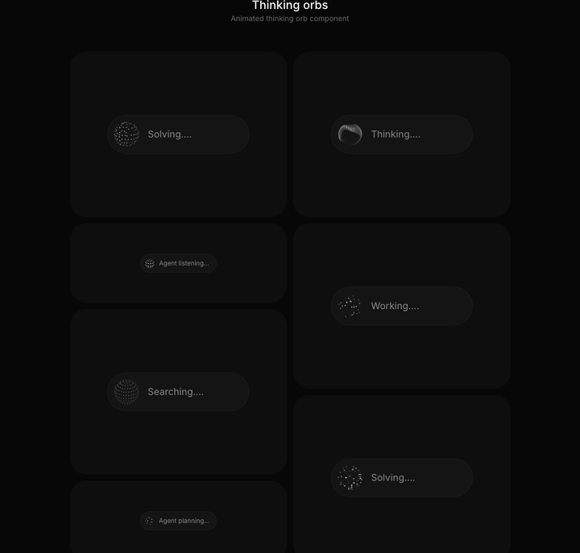
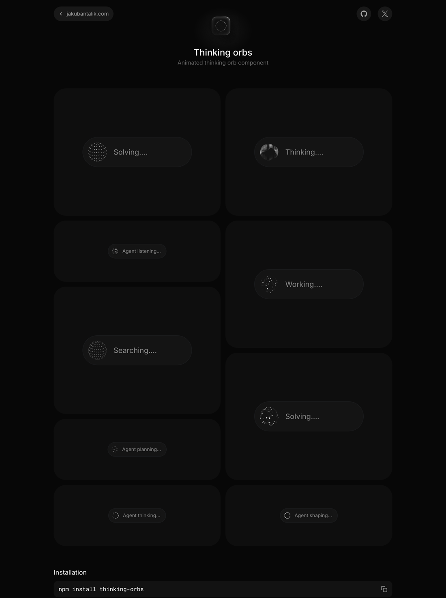
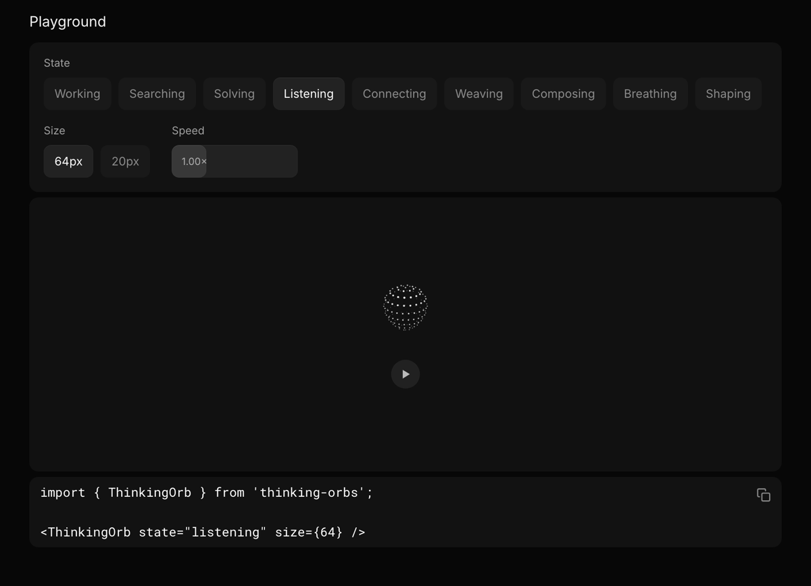
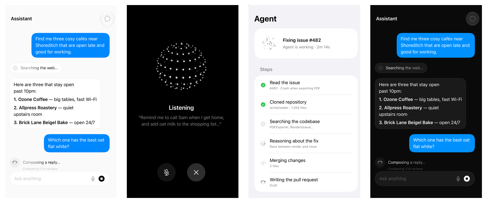

# thinking-orbs

Dotted thought-orb loading indicators for AI & agent UIs. Nine hand-tuned animated states, each shipped at two purpose-tuned sizes, rendered on a plain 2D canvas — no WebGL, no filters, works identically in Chrome, Safari and Firefox.

<p align="center">
  
</p>

**[Live demo](https://hemal08ce094.github.io/ThinkingOrbsSwiftUI/)** · [Original demo](https://orbs.jakubantalik.com) · [Upstream repository](https://github.com/Jakubantalik/thinking-orbs) · [SwiftUI port](../README.md)

> This folder is [Jakubantalik/thinking-orbs](https://github.com/Jakubantalik/thinking-orbs), the web library the SwiftUI port is built from, kept here as its reference. It adds a demo hosted on GitHub Pages, screenshots, the frozen-time parity harness and a React Native port. The library itself is unchanged.

## Demo

| Examples | Playground |
|---|---|
|  |  |

Run it locally:

```bash
git clone https://github.com/hemal08ce094/ThinkingOrbsSwiftUI
cd ThinkingOrbsSwiftUI/web
npm install
npm run dev        # http://localhost:5177
```

`demo/simple.html` is a minimal single-orb page, and `demo/parity.html` is the frozen-time capture harness used to check the native ports.

### Native iOS / macOS: SwiftUI

The same nine orbs, geometry-exact with this engine, as a Swift package: the [root of this repo](../README.md).



## Install

```bash
npm install thinking-orbs
```

## Quick start

```tsx
import { ThinkingOrb } from 'thinking-orbs';

function Status() {
  return <ThinkingOrb state="searching" size={64} />;
}
```

## States

Nine verbs an agent can be doing, each a distinct animation:

```tsx
<ThinkingOrb state="working" />     {/* particles on tilted orbits */}
<ThinkingOrb state="searching" />   {/* a scan meridian sweeps a dotted globe */}
<ThinkingOrb state="solving" />     {/* bands scramble, then click back solved */}
<ThinkingOrb state="listening" />   {/* a waveform rolls through the rings */}
<ThinkingOrb state="connecting" />  {/* a constellation wires itself */}
<ThinkingOrb state="weaving" />     {/* three strands plait around the sphere */}
<ThinkingOrb state="composing" />   {/* an undulating multi-band sash */}
<ThinkingOrb state="breathing" />   {/* a ring slowly morphing */}
<ThinkingOrb state="shaping" />     {/* dotted outline: circle → triangle → square */}
```

## Sizes

Two tuned presets — separate designs, not a scale factor. `64` for chat-avatar scale, `20` for inline-text scale. Each carries its own dot count, dot size and speed tuning:

```tsx
<ThinkingOrb state="working" size={64} />
<ThinkingOrb state="working" size={20} />
```

## Theme

Strictly monochrome — light ink for dark backgrounds, dark ink for light backgrounds — with the mode picked automatically from the host project:

```tsx
<ThinkingOrb theme="auto" />   {/* default — detects from the project */}
<ThinkingOrb theme="dark" />   {/* pin: light dots for dark backgrounds */}
<ThinkingOrb theme="light" />  {/* pin: dark dots for light backgrounds */}
```

`auto` resolves in three layers and updates live when any of them change:

1. an ancestor `data-theme="dark|light"` attribute or `dark`/`light` class (the Tailwind / shadcn convention), watched via `MutationObserver`;
2. otherwise `prefers-color-scheme`, subscribed for live OS theme switches;
3. SSR-safe — the canvas paints only on the client, after the theme has resolved.

## Other props

```tsx
<ThinkingOrb
  state="solving"
  size={20}
  speed={1.5}          // multiplier on the preset's baked speed
  paused={false}       // freeze on the current frame
  aria-label="Analysing repository…"  // overrides the per-state default
/>
```

All other `<canvas>` props (`className`, `style`, `data-*`, …) pass through.

## Accessibility & performance

- `role="img"` with a sensible per-state `aria-label` out of the box.
- `prefers-reduced-motion: reduce` renders a static representative frame — no animation — and still follows the live theme.
- Every instance pauses automatically when scrolled offscreen (`IntersectionObserver`) or when the tab is hidden, and resumes in phase — all instances share one clock.
- Plain 2D canvas arcs only: no `ctx.filter`, no SVG filters, no WebGL — the same pixels everywhere, cheap on low-end devices. Device-pixel-ratio capped at 2.

## License

MIT © Jakub Antalik
